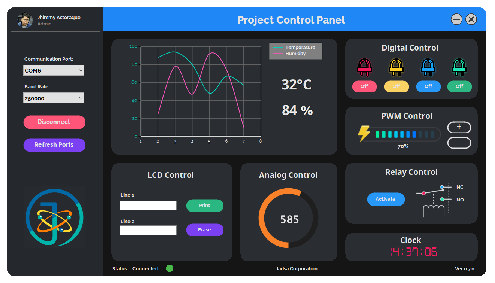

# HMI-Arduino-Firmware
This is the repo for the HMI Series of my Youtube channel and also the Windows Application build v1.0

Here's the link to the playlist with all the information for this project, and how to write the firmware for arduino and Winforms projects.
https://www.youtube.com/watch?v=MdItenf5Iyk&list=PLJ9xqaywaFW6b_IQ3Nlh-VayaLq7eKeax
 
Here's the link to the pcb and gerber files
https://www.pcbway.com/project/shareproject/HMI_CONTROLLED_CIRCUIT.html

If you have questions reach me on youtube
https://www.youtube.com/c/jadsatv
